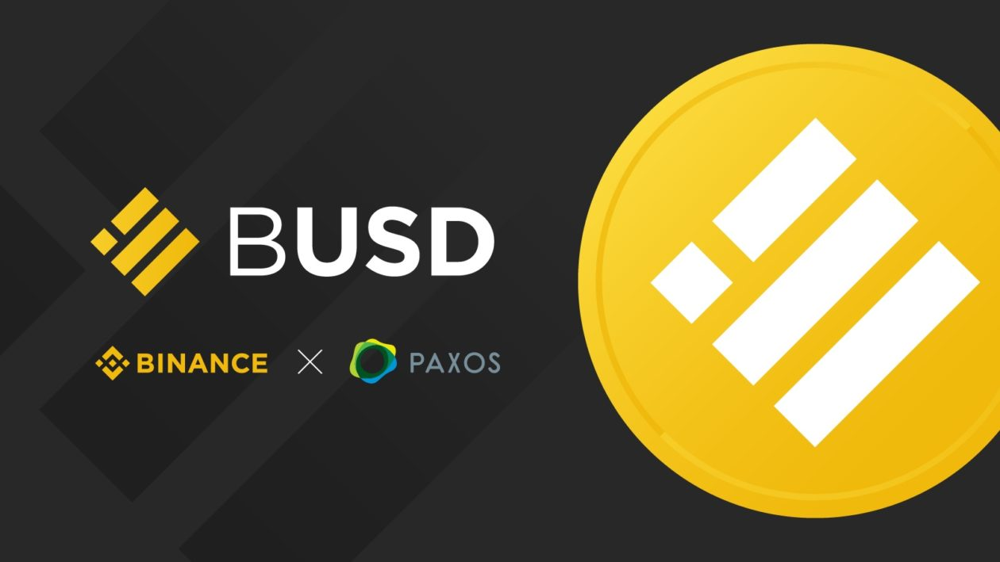

# Binance Canada Case Study

## Overview and Origin

* [Binance](https://www.binance.com/en/) was launched in July 2017

* The founders of Binance are:
  *  **Changpeng Zhao** (commonly known as CZ), an entrepreneure who has an impressive track record of startups. CZ studied at McGill University in Montreal and got his start in the blockchain working at Blockchain.com as head of technology.
  
  * **Yi He**, the leader of business, marketing and branding strategy at Binance. She lead the marketing strategies which propelled Binance to become the largest exchange in the world just 180 days from launch.
  * ***Sources found [here](https://www.binance.com/en/about)***
 

* Back in 2017, there was a lack of blockchain ecosystems and widespread exchanges that were easily accessible. CZ aimed to fill this gap.

* Binance was initially funded by Venture Capitalists which go by the names of:
  * Funcity Capital
  * Black Hole Capital
  * Limitless Crypto Investments
  
*  This first series of funding raised $88.8k
*  Binance has also recieved multiple rounds of funding for their ICO of BNB ($15m) and recently $500 million to invest in Web3 startups.
*  ***Sources found [here](https://www.crunchbase.com/organization/binance/company_financials)***

## Business Activities:

* Binance was initially created to solve many of the major problems which the crypto exchanges were facing at the time:
  * Slow transaction speed
  * High transaction fees
  * Very inefficient and complicated to use
  
* Binance attacked these problems right from the start which propelled them to the leading force in the industry. Binance also aims to create an ecosystem on the blockchain

* Binance's intended customers are anyone who is interested in investing in cryptocurrency. 30,000,000 people used Binance in 2022.

* Binance offers many things that most exchanges do not, these include:
  * Lowest trading fees
  * Can handle up to 1,400,000 orders per second
  * Extremely simple to buy and sell cryptocurrency as well as transferring to fiat
  * Offers a native token and stablecoin that is backed 1:1 by the US dollar with Paxos
  * High level of security
  * An ecosystem for new projects to encourage growth in the space

  
  * The technologies that binance use are
    * NGINX
    * Java
    * Next.js
    * Ant Design
    * HTML5
    * Microsoft Azure
    * Amazon RDS
    * GraphQL
    * Google Anylitics
    * Golang
    * Google Cloud APIs
  * Sourced from **[Slintel](https://www.slintel.com/company/binance/5c3b0164d55ae49f1b77c7a4)** and [Crunchbase](https://www.crunchbase.com/organization/binance/technology)

## Landscape:

* Binance is in the cryptocurrency domain of the financial industry.

* The major innovations in cryptocurrency over the last 10 years have been:

  * The creation and advancement of the Ethereum blockchain which paved the way for blockchain to be used for purposes other than cryptocurrency.
  * The creation of algorithmic stablecoins that investors can hold in volatile markets instead of transferring their crypto to fiat.
  * Dogecoin, the first memecoin that skyrocketed the popularity of cryptocurrency and brought an influx of new investors into low cap cryptocurrencies.
  * The creation of Non Fungible Tokens which use blockchain technology to provide proof of ownership.
  
* Some other notable blockchain companies are:
  * Coinbase
  * Circle
  * Uniswap
  * Opensea
  * Greyscale
  * Crypto.com
  * Kucoin

## Results

* Binance has impacted the world by creating a low fee blockchain ecosystem accessible to nearly everyone with a smartphone. Binance is also a leading factor in the advancement of blockchain infrastructure.

* The most common metrics to measure the success of an exchange are:
  * Users: 30,000,000
  * Volume: $34 trillion
  * Reserves: $75 billion
  * Transactions per second: 1,400,000
  
*  Binance leads the industry in all of these metrics, Coinbase coming in second with a total volume around $1.65 trillion (Source found [here](https://www.businessofapps.com/data/coinbase-statistics/#:~:text=Coinbase%20reached%20over%20%241%20trillion,volume%20it%20had%20in%202020.)).

## Recommendations

* I would advise Binance to capitalize on proof of ownership using NFTs and would encourage them to get government contracts in countries where identity fraud is prevalent.

* I think this would benefit Binance because they can use their influence and already established platform to connect hundreds of millions if not billions of new people to Web3.

* This would require blockchain technology in the form of NFTs.

* NFTs would be the most efficient way to provide prrof of ownership because they cannot be replicated and can be scaled massively.